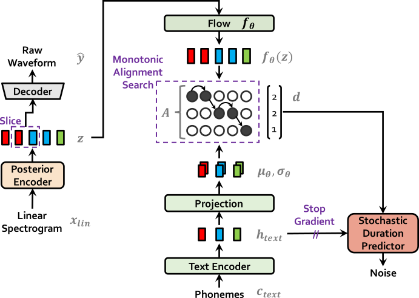

# VITS for Japanese
In the repository, I will introduce a VITS model that can train for Japanese on pytorch version 2.0.0.

*VITS: Conditional Variational Autoencoder with Adversarial Learning for End-to-End Text-to-Speech*

*Several recent end-to-end text-to-speech (TTS) models enabling single-stage training and parallel sampling have been proposed, but their sample quality does not match that of two-stage TTS systems. In this work, we present a parallel end-to-end TTS method that generates more natural sounding audio than current two-stage models. Our method adopts variational inference augmented with normalizing flows and an adversarial training process, which improves the expressive power of generative modeling. We also propose a stochastic duration predictor to synthesize speech with diverse rhythms from input text. With the uncertainty modeling over latent variables and the stochastic duration predictor, our method expresses the natural one-to-many relationship in which a text input can be spoken in multiple ways with different pitches and rhythms. A subjective human evaluation (mean opinion score, or MOS) on the LJ Speech, a single speaker dataset, shows that our method outperforms the best publicly available TTS systems and achieves a MOS comparable to ground truth.*

We also provide the [pretrained models](https://drive.google.com/file/d/13LShhGTpVhwQTWonR-mzzZA4-burHzVD/view?usp=sharing).
<table style="width:100%">
  <tr>
    <th>VITS at training</th>
    <th>VITS at inference</th>
  </tr>
  <tr>
    <td></td>
    <td></td>
  </tr>
</table>


## Pre-requisites
0. Python >= 3.6
0. Clone this repository
0. Install python requirements. Please refer [requirements.txt](requirements.txt)
0. Download datasets
    1. Download and extract the [Japanese Speech dataset](https://sites.google.com/site/shinnosuketakamichi/publication/jsut), then choose `basic5000` dataset and move to `jp_dataset` folder. 
0. Build Monotonic Alignment Search and run preprocessing if you use your own datasets.
```sh
# Cython-version Monotonoic Alignment Search
cd monotonic_align
python setup.py build_ext --inplace

# Preprocessing (g2p) for your own datasets. Preprocessed phonemes for LJ Speech and VCTK have been already provided.
# python preprocess.py --text_index 1 --filelists filelists/jp_audio_text_train_filelist.txt filelists/jp_audio_text_val_filelist.txt filelists/jp_audio_text_test_filelist.txt
```


## Training Example
```sh
# JP Speech
python train.py -c configs/jp_base.json -m jp_base
```


## Inference Example
See [vits_apply.ipynb](vits_apply.ipynb)
